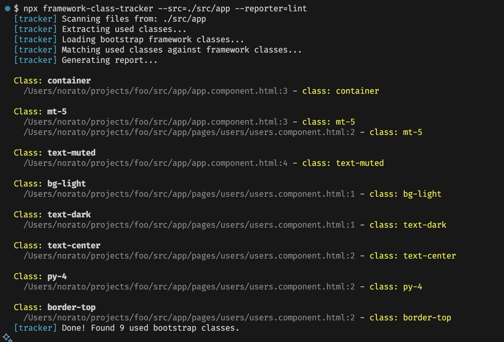

# framework-class-tracker

A CLI tool to scan your project files and identify which CSS classes from a specific framework (Bootstrap, Materialize) are actually in use. Perfect for cleaning up unused CSS classes and optimizing your stylesheets!

## 🎯 Lint-Style Output with Clickable Links



The **lint reporter** shows exactly where each CSS class is used in your codebase with clickable file paths that open directly in your editor!

## ✅ Features

- 🔍 **Smart Class Detection**: Scans all your source files to find used CSS classes
- 📍 **Precise Location Tracking**: Shows exact file paths and line numbers
- 🎨 **Multi-Framework Support**: Bootstrap and Materialize CSS (more coming soon!)
- 📝 **Two Report Modes**:
  - **Lint mode**: Terminal-friendly output with clickable links
  - **Text mode**: Simple file report for documentation
- 🚀 **Performance Focused**: Help identify and remove unused framework classes
- 🎯 **Developer Friendly**: Clear, colorful output with actionable insights

## 💡 Why Use This Tool?

- **🎯 Find Dead Code**: Instantly identify which Bootstrap/Materialize classes are actually being used
- **⚡ Optimize Bundle Size**: Remove unused CSS by knowing exactly what to keep
- **🔍 Code Navigation**: Click on any file:line reference to jump directly to the code
- **🧹 Clean Refactoring**: Safely remove framework dependencies with confidence
- **📊 Migration Helper**: Perfect for transitioning between CSS frameworks

## 📦 Installation

```bash
npm install -g framework-class-tracker
# or
pnpm add -g framework-class-tracker
```

To use in a local project:

```bash
pnpm add -D framework-class-tracker
```

## 🚀 Quick Start

### 🔥 Lint Mode (Recommended)

Get instant, actionable output with clickable file paths:

```bash
framework-class-tracker --src=./src --reporter=lint
```

This shows:

- ✅ Each CSS class found in your code
- 📍 Exact file locations with line numbers
- 🔗 Clickable paths that open in your editor
- 🎨 Color-coded output for better readability

### Text Report Mode

For a simple file output:

```bash
framework-class-tracker --src=./src
```

This generates a `framework-report.txt` file with all the used classes.

### Using Materialize Framework

To analyze Materialize CSS classes instead of Bootstrap:

```bash
framework-class-tracker --src=./src --framework=materialize
```

### Screenshot


### Using Materialize Framework

To analyze Materialize CSS classes instead of Bootstrap:

```bash
framework-class-tracker --src=./src --framework=materialize
```

### Custom CSS Source

You can also specify the CSS source manually:

```bash
framework-class-tracker --src=./src --frameworkPath=./node_modules/bootstrap/dist/css
```

## 🧠 How it works

1. Scans all supported source files recursively inside the `--src` folder.
2. Extracts class names and their locations (file and line number).
3. Loads and parses the target framework's CSS files.
4. Compares the class names found with those available in the framework.
5. Generates a report in the specified format (`text` or `lint`).

## 🛠 Supported frameworks

Currently supported:

- `bootstrap` (default)
- `materialize`

More to come (planned):

- `bulma`
- `foundation`

## ✨ Coming soon

- Support for multiple frameworks in a single scan
- JSON/CSV output formats
- Filtering by component or screen

## 🧪 Development

Clone and run locally:

```bash
pnpm install
```

To build the project:

```bash
pnpm build
```

To test locally in another project, you can use the `link` script. It will build the project and create a global symlink so you can run the command in any directory.

```bash
pnpm run link

# Then, in another repository:
framework-class-tracker --src=./src --reporter=lint
```

Run tests:

```bash
pnpm test
```

## 📄 License

MIT
